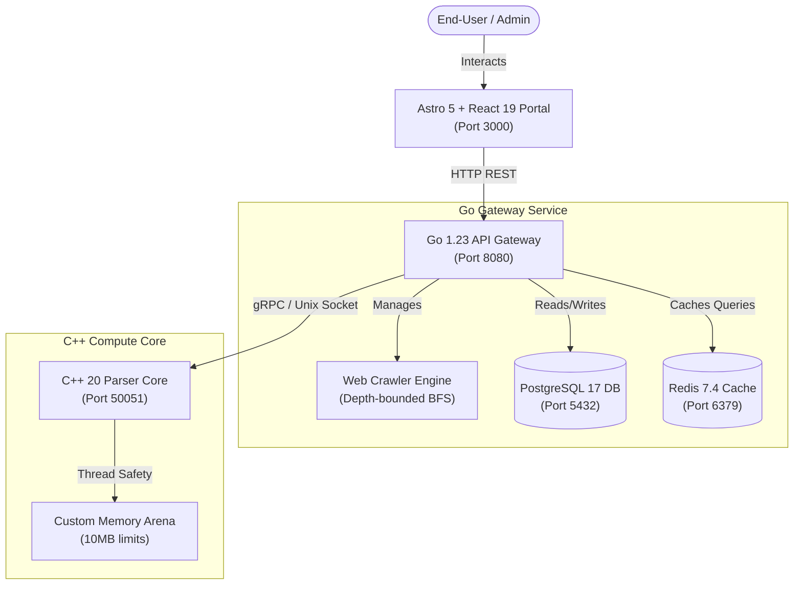

# Nexus Search Engine

Nexus Search Engine is a high-performance, single-tenant vertical search and indexing engine built on a robust **Pull, Index, and Query** architecture. The system is designed to crawl target websites down to clean, searchable metadata, compile inverted index text structures, and resolve keyword search matches with extremely low latency. 

By running as an isolated network topology, each deployment guarantees absolute data sovereignty, avoids multi-tenant noisy-neighbor resource contention, and allows domain-specific index curation.

---

## System Architecture



---

## Tech Stack & Version Commitments

*   **Frontend**: Astro 5.0, React 19, Tailwind CSS 4.0, Nginx (for production stage container)
*   **API Gateway & Crawler**: Go 1.23, gRPC Client, RESTful routing, PostgreSQL adapter, Redis client
*   **Indexing Compute Server**: C++ 20, gRPC Server (gRPC 1.51+), Protobuf 3.21+, Custom Thread-Safe Memory Arena
*   **Datastores**: PostgreSQL 17 (metadata, crawl tracking, and document bodies), Redis 7.4 (query caches)
*   **Orchestration**: Docker Compose (multi-stage compilation)

---

## Orchestrated Setup (Docker - Recommended)

The entire microservice stack is configured to compile, link, and run out-of-the-box using Docker Compose.

### Prerequisites
*   [Docker Desktop](https://www.docker.com/products/docker-desktop/) (v20.10+ / Compose v2+)

### Launching the Stack
1. Clone the repository and navigate to the project directory:
   ```bash
   cd search-engine
   ```
2. Build and start all services in detached mode:
   ```bash
   docker-compose up -d --build
   ```
3. Verify that all 5 containers are running and healthy:
   ```bash
   docker ps
   ```

### Ports & Access
*   **Astro Admin Portal / Search UI**: [http://localhost:3000](http://localhost:3000)
*   **Go API Gateway REST Endpoint**: [http://localhost:8080](http://localhost:8080)
*   **C++ Index gRPC Server**: `localhost:50051`
*   **PostgreSQL Database**: `localhost:5432`
*   **Redis Cache**: `localhost:6379`

---

## Local Bare-Metal Setup (Development Mode)

If you wish to run the microservices locally outside of Docker containers, follow the steps below:

### 1. Prerequisites
Ensure the following packages are installed on your host system:
*   **Go**: 1.23+
*   **C++ Compiler**: GCC 13+ / Clang 16+ supporting C++20
*   **CMake**: 3.15+
*   **Node.js**: v20+ & npm
*   **PostgreSQL**: 17
*   **Redis**: 7.4

---

### 2. Protobuf Compilation
Before compilation, generate the gRPC serialization contracts for the Go and C++ services.

#### Generating Go Stubs
If you have Docker available, compile using the automated Alpine generator wrapper:
```bash
sh generate_proto.sh
```
Or run the commands manually if you have `protoc` installed locally:
```bash
protoc --go_out=. --go-grpc_out=. -I shared/proto shared/proto/search_engine.proto
```

---

### 3. Setup Datastores
1. Ensure **PostgreSQL** is running and create a database named `search_engine`:
   ```sql
   CREATE DATABASE search_engine;
   ```
2. Ensure **Redis** is running on default port `6379`.
3. Set the following environment variables or use default fallbacks:
   ```env
   DB_HOST=127.0.0.1
   DB_PORT=5432
   DB_USER=postgres
   DB_PASSWORD=postgres
   DB_NAME=search_engine
   REDIS_ADDR=127.0.0.1:6379
   CPP_PARSER_ADDR=127.0.0.1:50051
   ```

---

### 4. Build C++ Index Compute Core
Compile and run the gRPC C++ server:
```bash
cd services/index-compute-cpp
mkdir build && cd build
cmake -DCMAKE_BUILD_TYPE=Release ..
make -j$(nproc)
./index_compute_server
```

---

### 5. Build Go Gateway & Crawler
Launch the REST server:
```bash
cd services/crawler-gateway-go
go run cmd/main.go
```

---

### 6. Build Astro Frontend Portal
Start the frontend development server:
```bash
cd apps/search-frontend-astro
npm install
npm run dev
```
Open [http://localhost:3000](http://localhost:3000) in your browser.

---

## Core API Endpoints

### 1. System Telemetry & Health
*   **Method**: `GET`
*   **Endpoint**: `/api/v1/health`
*   **Response**:
    ```json
    {
      "cpu_cores": 8,
      "allocated_memory": "4.20 MB",
      "goroutines": 24,
      "db_status": "Optimal",
      "cpp_status": "Active",
      "redis_status": "Optimal"
    }
    ```

### 2. Trigger Depth-Bounded Crawl
*   **Method**: `POST`
*   **Endpoint**: `/api/v1/crawl`
*   **Body**:
    ```json
    {
      "url": "https://example.com",
      "depth": 2
    }
    ```

### 3. Retrieve Indexed Documents
*   **Method**: `GET`
*   **Endpoint**: `/api/v1/documents`
*   **Response**: Array of scraped documents containing raw text and links.

### 4. Search Query Matcher
*   **Method**: `GET`
*   **Endpoint**: `/api/v1/search`
*   **Query Params**: `?q=search-term`
*   **Response**: Rank-sorted keyword-matched search records.
