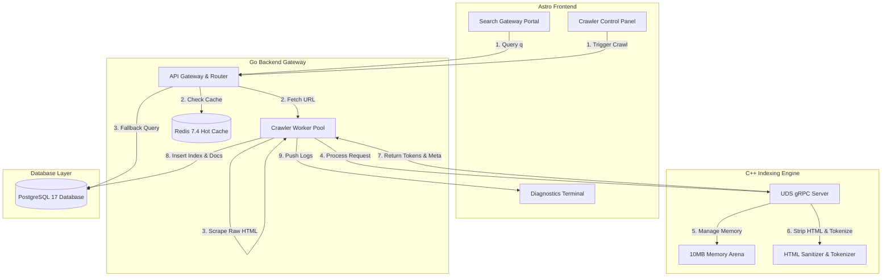
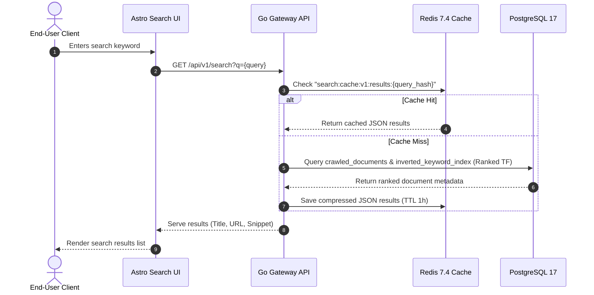
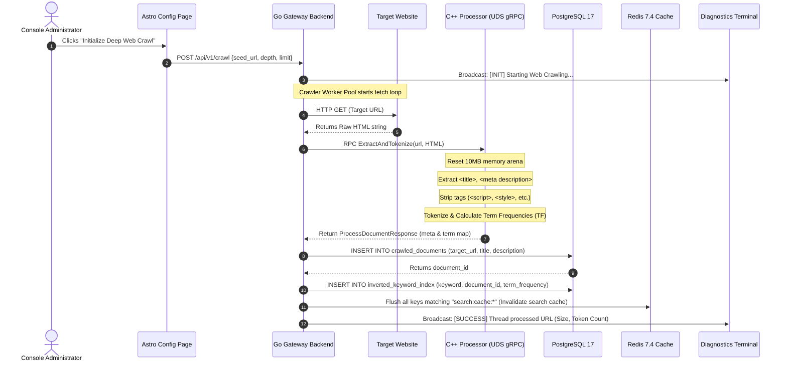

# Implementation Plan: Core Isolated Search & Indexing Engine (Latest Versions Commitment)

This plan covers the implementation of a domain-agnostic, single-tenant vertical search engine. The project follows the specifications detailed in [PRD.md](file:///s:/ajay-git/search-engine/PRD.md) and [HLD.md](file:///s:/ajay-git/search-engine/HLD.md).

All frameworks and platforms will use their **latest stable production versions** as of 2026:
- **Astro**: v5.0 (Latest stable release)
- **React**: v19.0 (Latest stable release)
- **TailwindCSS**: v4.0 (Latest stable release, native CSS-first configuration)
- **Go**: v1.23 (Latest stable release)
- **C++**: Standard C++20 / C++23 (compiled with modern GCC or MSVC)
- **gRPC (C++ & Go)**: v1.66+ (Latest stable release)
- **PostgreSQL**: v17 (Latest stable release)
- **Redis**: v7.4 (Latest stable release)

---

## High-Level System Architecture & Flow

The system consists of a server-rendered web interface, an HTTP gateway, and a C++ text processing daemon connected over local high-speed Unix Domain Sockets (UDS).

---

## Service Interactions & Data Flow Details

### 1. User Search Flow (Query Phase)
This flow handles user-facing keyword queries. The target latency is `<50ms` at a high concurrency load.

### 2. Admin Crawler Flow (Ingestion & Indexing Phase)
This flow is triggered by an administrator to seed urls and deep-crawl a specific domain.

---

## Technical Stack & Version Integration

### 1. Astro v5.0 + React v19.0 + TailwindCSS v4.0
We will initialize the frontend using the latest version of Astro. Astro v5 features the new Content Layer API and improved server islands. React v19 brings action hooks and native support for document metadata, which aligns with our SEO requirements. TailwindCSS v4.0 uses a CSS-first configuration model, removing the need for a complex JavaScript config file and compiling much faster.

### 2. Go v1.23 Gateway
The backend gateway will compile with Go 1.23, utilizing advanced slice functions and routing enhancements. It will run a multi-threaded web scraper, connect to PostgreSQL 17 for inverted indexing, and interface with Redis 7.4 for search query caching.

### 3. C++20 HTML processing daemon
The C++ tokenizer will be built using the C++20 standard, using advanced features like concepts, spans, and improved thread synchronization wrappers. It communicates with the Go backend over a modern gRPC Unix Domain Socket (UDS) layer, executing isolated HTML scraping and word catalog density calculations inside a fixed 10MB thread-safe memory arena.

---

## User Review Required

> [!IMPORTANT]
> **No-compromise Latest Version Build**:
> We are using the latest libraries (React 19, Tailwind 4, Astro 5, Postgres 17, Redis 7.4). Ensure that your local compiler (GCC/MSVC) supports C++20, and your local Go toolchain is upgraded to at least 1.23.
> 
> **Docker Integration**:
> To ensure these exact versions compile and run seamlessly without local toolchain pollution, we will provide a `docker-compose.yml` that mounts the workspace, compiles the C++ daemon inside a gRPC-enabled container, and hosts PostgreSQL 17 and Redis 7.4 services.

---

## Proposed Changes

### Configuration & Docker Orchestration
#### [NEW] [docker-compose.yml](file:///s:/ajay-git/search-engine/docker-compose.yml)
- Spins up PostgreSQL 17, Redis 7.4, the Go API Gateway, and the C++ Indexing Engine.
- Sets up standard networks and health checks.

### Shared Protocol Buffer Definition
#### [NEW] [search_engine.proto](file:///s:/ajay-git/search-engine/shared/proto/search_engine.proto)
- Defines the `HTMLProcessor` gRPC service interface.

---

### C++ Unmanaged Text Processing Tier
#### [NEW] [arena.hpp](file:///s:/ajay-git/search-engine/services/index-compute-cpp/src/arena/arena.hpp)
- Thread-safe Memory Arena with 10MB capacity limit.
#### [NEW] [parser.hpp](file:///s:/ajay-git/search-engine/services/index-compute-cpp/src/parser/parser.hpp) / [parser.cpp](file:///s:/ajay-git/search-engine/services/index-compute-cpp/src/parser/parser.cpp)
- HTML Tag Stripper and Word Tokenizer using C++20 standards.
#### [NEW] [main.cpp](file:///s:/ajay-git/search-engine/services/index-compute-cpp/src/main.cpp)
- gRPC server loop running on a Unix Domain Socket (or localhost port bind).
#### [NEW] [CMakeLists.txt](file:///s:/ajay-git/search-engine/services/index-compute-cpp/CMakeLists.txt)
- Defines compiler options (`-std=c++20`), gRPC, and Protobuf link targets.

---

### Go Web Crawler & API Gateway
#### [NEW] [main.go](file:///s:/ajay-git/search-engine/services/crawler-gateway-go/cmd/main.go)
- Entry point for the Go 1.23 backend.
#### [NEW] [crawler.go](file:///s:/ajay-git/search-engine/services/crawler-gateway-go/internal/crawler/crawler.go)
- Crawling scraper with concurrency and robots.txt checks.
#### [NEW] [db.go](file:///s:/ajay-git/search-engine/services/crawler-gateway-go/internal/db/db.go)
- PostgreSQL 17 query mapping layer.
#### [NEW] [ipc_client.go](file:///s:/ajay-git/search-engine/services/crawler-gateway-go/internal/ipc/ipc_client.go)
- gRPC client targeting the C++ service.
#### [NEW] [routes.go](file:///s:/ajay-git/search-engine/services/crawler-gateway-go/internal/server/routes.go)
- Gin gateway router with search API caching in Redis 7.4.

---

### Astro Frontend
#### [NEW] [package.json](file:///s:/ajay-git/search-engine/apps/search-frontend-astro/package.json)
- Imports Astro v5.0, React v19.0, Tailwind v4.0, and corresponding plugins.
#### [NEW] [global.css](file:///s:/ajay-git/search-engine/apps/search-frontend-astro/src/styles/global.css)
- Imports Tailwind CSS v4 directive: `@import "tailwindcss";`
#### [NEW] [Sidebar.jsx](file:///s:/ajay-git/search-engine/apps/search-frontend-astro/src/components/Sidebar.jsx)
- Left persistent navigation bar.
#### [NEW] [Header.jsx](file:///s:/ajay-git/search-engine/apps/search-frontend-astro/src/components/Header.jsx)
- Top bar showing epoch.
#### [NEW] [Dashboard.jsx](file:///s:/ajay-git/search-engine/apps/search-frontend-astro/src/components/Dashboard.jsx)
- Health metrics and SVG charts.
#### [NEW] [CrawlerConfig.jsx](file:///s:/ajay-git/search-engine/apps/search-frontend-astro/src/components/CrawlerConfig.jsx)
- Seeding configuration form.
#### [NEW] [DiagnosticsTerminal.jsx](file:///s:/ajay-git/search-engine/apps/search-frontend-astro/src/components/DiagnosticsTerminal.jsx)
- Active console logger with live mock streaming capability.
#### [NEW] [DocumentExplorer.jsx](file:///s:/ajay-git/search-engine/apps/search-frontend-astro/src/components/DocumentExplorer.jsx)
- Tabular indexed page browser.
#### [NEW] [SearchResultsIsland.jsx](file:///s:/ajay-git/search-engine/apps/search-frontend-astro/src/components/SearchResultsIsland.jsx)
- Google-style search gateway.

---

## Verification Plan

### Automated Tests
- Validate Astro + React compiles cleanly under production builds.
- Validate Go 1.23 endpoints with simple mock handlers.
- Compile C++ code with `-std=c++20` flag.

### Manual Verification
- Test interactive pages (Dashboard, Terminal, Config, Document Explorer, Search UI) on the Astro dev server.
- Verify state transitions, telemetry rendering, and responsive sidebar navigation.
